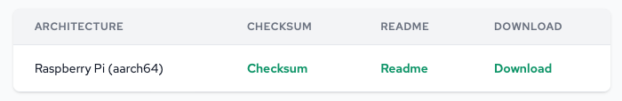
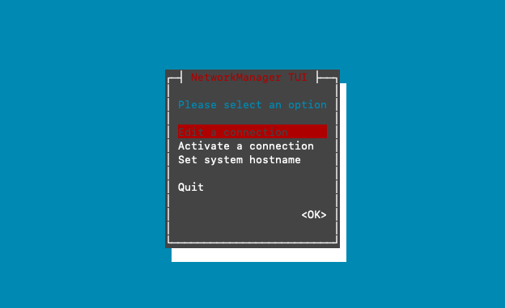
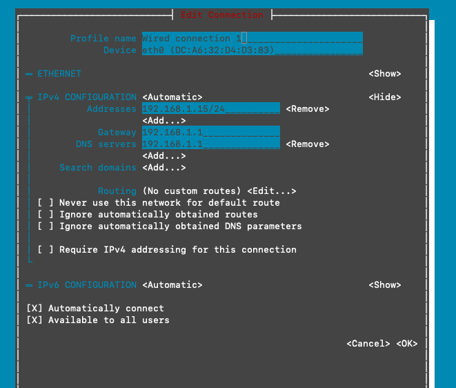
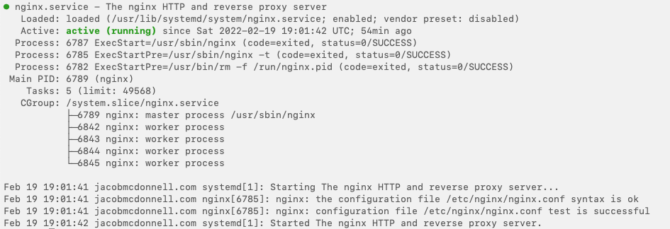
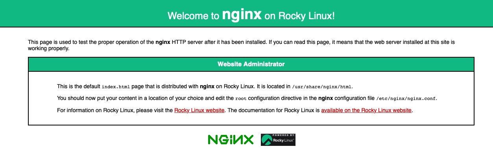

# Hosting a Website on the Raspberry Pi with Rocky Linux

First Download Rocky Linux for the Raspberry Pi 3 & 4 from [their website](https://rockylinux.org/alternative-images).

Next you want to burn this image to the sd card that you are going to use. Now start up the Raspberry Pi and login with the default user `rocky` and the password is `rockylinux`. 

To make the image take up the whole drive, run:

```sh
sudo rootfs-expand
```

Now, you should create a new user:

```sh
sudo useradd -m -g users -G wheel userName
sudo passwd username
```

Next, we should delete the default user so logout and login to your new user:

```sh
sudo userdel rocky
```


***

## Setting a static IP address 

The easiest way is to run:

```shell
sudo nmtui
```



Select **Edit** a connection and select your network interface. 



Select **Show** for **IPv4 CONFIGURATION** and enter the IP you want to set. Then select **OK** at the bottom, and quit the program.

## Securing the PI

### SSH Key Authorization

The best way to secure the pi is to use an SSH key to login instead of a password. First you want to generate an SSH key by running on your computer:

```sh
ssh-keygen -t rsa
```

Next, to copy your SSH key to your server, run:

```sh
ssh-copy-id -i ~/.ssh/mykey user@host
```

To test that it works, run:

```sh
ssh -i ~/.ssh/mykey user@host
```

If it worked, you should be able to connect without needing a password.

To force an SSH key to login, edit `/etc/ssh/sshd_config` using nano or vim.

Change `PermitRootLogin yes` to `PermitRootLogin no` and `PasswordAuthentication yes` to `PasswordAuthentication no`.

### Setting up fail2ban

First start and enable firewalld to run at boot:

```sh
sudo systemctl start firewalld
sudo systemctl enable firewalld
```

Now, enable the EPEL repository for Rocky Linux and install fail2ban:

```sh
sudo dnf install epel-release -y
sudo dnf install fail2ban fail2ban-firewalld -y
```

Start and enable fail2ban to run at boot:

```sh
sudo systemctl start fail2ban
sudo systemctl enable fail2ban
```

Now, we have to make fail2ban work with firewalld, run:

```sh
sudo mv /etc/fail2ban/jail.d/00-firewalld.conf /etc/fail2ban/jail.d/00-firewalld.local
sudo systemctl restart fail2ban
```

To create an SSH jail, edit the ssh config file with vim or nano:

```sh
sudo vim /etc/fail2ban/jail.d/sshd.local
```

Paste the following into the file and change the values as you see fit:

```
[sshd]
enabled = true
bantime = 1d
maxretry = 3
```

Save and close the file and restart fail2ban:

```sh
sudo systemctl restart fail2ban
```

## Setting up Dynamic DNS with Google Domains

### Configuring Google Domains

First, on [Domains.google.com](https://domains.google.com/) go the DNS page for your domain. Scroll down and click on **Show advanced settings**, Click **Manage dynamic DNS**, and then click **Create new record**. Enter your subdomain or leave it black for the domain itself. Finally, click Save.

### Installing ddclient

To install ddclient you need to enable the PowerTools Repo for the perl dependency.

First, install `dnf-plugins-core`:

```sh
sudo dnf -y install dnf-plugins-core
sudo dnf upgrade
```

Next, enable PowerTools:

```sh
sudo dnf config-manager --set-enabled powertools
```

Then, you can install ddclient:

```sh
sudo dnf install ddclient
```

Now, we want to edit the config file for ddclient:

```sh
sudo vim /etc/ddclient.conf
```

You'll want to look for where it says `protocol=dyndns2`, and enter your information:

```
##
## nsupdate.info IPV4(https://www.nsupdate.info)
##
protocol=dyndns2
use=web, web=http://ipv4.nsupdate.info/myip
server=domains.google.com
login=username
password=password
domain.tld
```

Wait about 5 minutes and on the Google Domains website, under Dynamic DNS you should see your IP address under **Data**.

## Setting up NGINX and Let's Encrypt

### Installing NGINX

First, install nginx Webserver:

```sh
sudo dnf install nginx
```

Next, start and enable nginx to run at boot:

```sh
sudo systemctl start nginx
sudo systemctl enable nginx
```

Then, check the status to see if it is running:

```sh
sudo systemctl status nginx
```



Now, we have to allow HTTP traffic through the firewall:

```sh
sudo firewall-cmd --add-service=http --permanent
sudo firewall-cmd --add-service=https --permanent
sudo firewall-cmd --reload
```

In a web browser, go to the local ip of the server and you should see the nginx welcome page.



### Configuring NGINX

First, make your folder for the website, this is where your website will live:

```sh
sudo mkdir -p /var/www/websiteName
```

Next, we need to set the proper permissions to make sure everything works:

```sh
sudo chown -R nginx /var/www/websiteName
sudo chmod -R 755 /var/www/websiteName
```

Now, we will create the config file for website:

```sh
sudo vim /etc/nginx/conf.d/websiteName.conf
```

and paste the following into the file:

```
server {
    listen 80;
    server_name domain.tld www.domain.tld;
    root /var/www/websiteName;
    index index.php index.html index.htm;
    access_log /var/log/nginx/websiteName.access.log;
    error_log /var/log/nginx/websiteName.error.log;
}
```

Now, confirm that the nginx configuration is ok:

```sh
sudo nginx -t
```

Restart nginx:

```sh
sudo systemctl restart nginx
sudo systemctl status nginx
```

Next, set SELinux to permissive mode:

```sh
sudo setenforce permissive
sudo getenforce
```

Now, we will need to set SELinux to permissive mode permanently:

```sh
sudo sed -i --follow-symlinks 's/SELINUX=enforcing/SELINUX=permissive/g' /etc/sysconfig/selinux
```

### Installing and Running Certbot

To install Certbot run:

```sh
sudo dnf install certbot python3-certbot-nginx
```

To get SSL certificates for your websites run:

```sh
sudo certbot --nginx
```

Answer the prompts that show up on screen as you wish.

To configure auto renewal of the SSL certificate run:

```sh
crontab -e
```

and add the following line:

```
0 12 * * * /usr/bin/certbot renew --quiet
```

This will check everyday at noon to see if the certificate will expire in the next month, if so it will renew the certificate.

Now your website should be operational. 